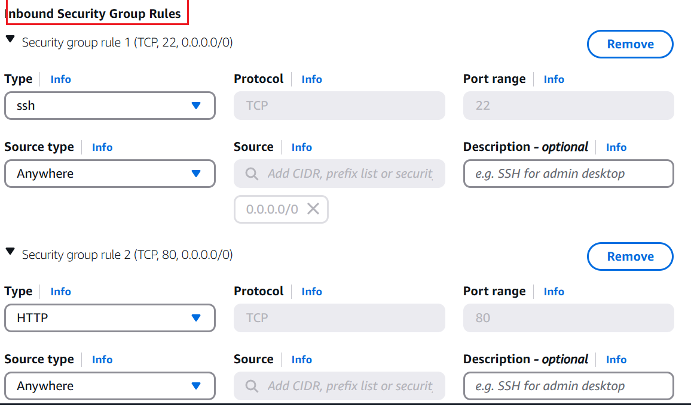
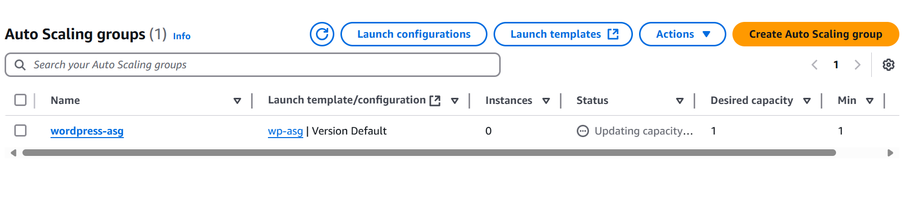

# Wordpress-site-on-AWS
This is a capstone project for wordpress site on AWS using VPC
## VPC Setup
- The Ip address range for the VPC was 10.0.0.0/16. This means the starting IP is 10.0.0.0 and the ending IP is 10.0.255.255 with total address 0f 65,536

- The VPC was suceessful created.

- The wordpress VPC subnets was created.

- The wordpress VPC subnets was sucessfully created.

- Private subnet was configure and cidr was set to 10.0.7.0/24 with 251 addresses

- Public subnet was configure and cidr was set to 10.0.6.0/24 with 251 addresses.
- The cidr was choosing to avoid overlap between the public and private subnet.
- Different network zone was selected for the public and private to ensure availability.

- Route tables was configured for each subnet.

- Subnets were associated with each subnet.

## Public and Private Subnet with NAT Gateway.
- Creating internet gateway for public subnet.

- Attaching internet gateway to the wordpress VPC.

- Adding internet gate way to route table associated with public subnet internet access.

- Creating and configuring NAT gateway for private subnet interet access 

- Associating NAT gateway to private subnet for secure configuration.

- Visualizing VPC resource map to show that proper achitectures.

## AWS MySQL RDS Setup
- RDS Instances was created

- security group was configure for the rds with private subnet and NAT gateway for secure database internet access.

- EC2 instances for wordpress web server was created. 

- Security group was configured for the EC2 wordpress instances. 

- Wordpress instances was connected to Amazon. 

- Mysql server was installed on linux. 

- RDS MySQL was configured for wordpress instances connection 

- Setting up user and login password for mysql and connecting the Wordpress to the mysql. 

## EFS Setup for WordPress Files
- Installing apache

- starting apache

- Testing install apache by loading the public IP on browser

- Fetching wordpress files from the web and unzipping it.

- Configuring EFS files for mounting on wordpress instance

- coping wordpress file to /var/www/html/ format

- Testing the EFS setup and wordpress web

## Application Load Balancer and Auto Scaling
- creating target group for load balancing

- creating load balancing and listener rules for routing traffic

- creating of auto scaling and integration with load balancer

## Testing
The load balance was tested to ensure it function properly. Also, autoscalling was visualize to ensure the wordpress web deployment is cost effectives.